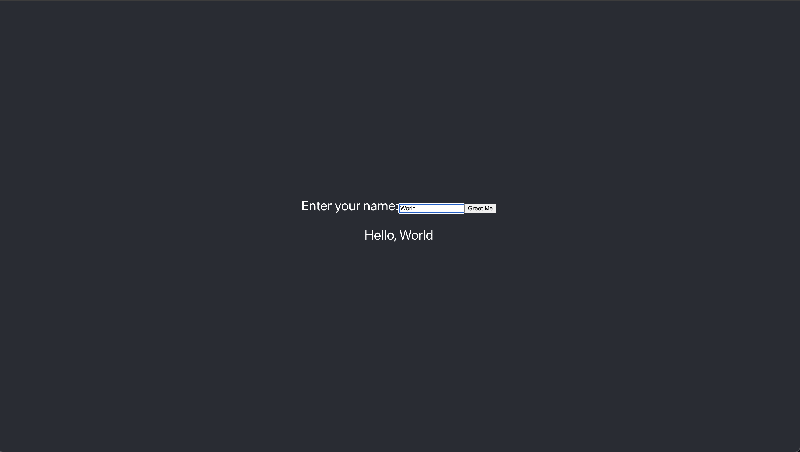

# Demo: gRPC Server + Web Client



This project demonstrates a React Web client interacting with a gRPC server through an app proxy.

## Architecture Overview

**gRPC** is an open source [Remote Procedure Call (RPC)](https://en.wikipedia.org/wiki/Remote_procedure_call) framework developed by Google.
It uses [protocol buffers](https://protobuf.dev/) (commonly referred to as "protobufs") to provide a language- and platform-neutral mechanism for serializing structured data.
At the transport layer it uses [HTTP/2](https://datatracker.ietf.org/doc/html/rfc9113) or higher.

Because most server/client communications on the web rely on HTTP/1.1 (as is the case with the web client in this demo), a proxy is necessary as a translation layer between client requests (over HTTP/1.1) and the gRPC server (HTTP/2).
Envoy serves as that proxy for this project because it provides first-class support for gRPC, HTTP/1.1, and HTTP/2 out of the box.
Though I haven't looked much further, it's probable that other service proxies would work nicely for this purpose.

It's worth noting that, because protobufs support a variety of languages, the server and client could have been written in [nearly anything](https://protobuf.dev/getting-started/).
The choice to build the server in TypeScript and the web client in JavaScript was fairly arbitrary.

### Built With

*   [gRPC](https://grpc.io/) - A high performance, open source universal RPC framework
*   [gRPC-Web](https://github.com/grpc/grpc-web) - A JavaScript implementation of gRPC for browser clients.
*   [Envoy](https://www.envoyproxy.io/) - An L7 proxy and communication bus designed for large modern service oriented architectures.

## Getting Started

These instructions will get you a copy of the project up and running on your local machine for development and testing purposes.

### Prerequisites

*   [Docker](https://www.docker.com/) - An open platform for developing, shipping, and running applications.
*   [NodeJS](https://nodejs.org/en) - A free, open-source, cross-platform JavaScript runtime environment.
*   Local ports `3000`, `8080`, `9090`, and `9901` are free to use.

### Installation

#### gRPC Server

The gRPC server in this demo is written in TypeScript on NodeJS.

1.  Install the dependencies:

    ```sh
    cd services/server
    npm install
    ```

    You may use [Yarn](https://yarnpkg.com/) instead on NPM, though these instructions will not cover that.

2.  To start the gRPC server, run:

    ```sh
    npm start
    ```

#### Envoy

Envoy Proxy runs in a docker container and is orchestrated via [Docker Compose](https://docs.docker.com/compose/) which ships with Docker.

1.  To build the image and run the container, run:

    ```sh
    cd services/envoy
    docker compose up -d
    ```

2.  You can check to see that Envoy is running correctly by either tailing the docker logs:

    ```sh
    docker compose logs -f
    ```

    Or by visiting the envoy admin web page in a browser at:

    ```sh
    localhost:9901
    ```

#### Web Client

While I would have liked to implement the client-side application in TypeScript as well, at the time of this writing, gRPC Web support for TypeScript is [experimental](https://www.npmjs.com/package/grpc-web#typescript-support), and I was not able to set it up successfully.

The JavaScript client runs in the console and simply asks the user for their name, and returns a personalized greeting using gRPC!

1.  Install the dependencies:

    ```sh
    cd services/web-client
    npm install
    ```

2.  We need to compile our protobuf into a language the client understands (in this case, JavaScript).
    To do this, run:

    ```sh
    npm run compile:proto
    ```

    This convenient npm command invokes the `scripts/proto-gen.sh` script in the root of this project.
    It's worth taking a minute or two to familiarize yourself with what the script is doing before running it.

3.  Run the web client:

    ```sh
    npm start
    ```

    Visit the web app at `localhost:3000` in your favorite browser.

## Conclusion

With any luck, you were able to spin up this project and witness gRPC in action!
At this point you may be saying, "well that's all fine and good, but when would I use this in a real project?"
Well, here are my thoughts on that.

### When to Consider gRPC

1.  You have a microservice architecture that requires a great deal of fast, efficient inter-service communication.
2.  Your organization requires strongly typed, clear, and concise API contracts for effective cross- team/service communication.
3.  You have many system components written in many different languages and need a protocol that is language-agnostic.
4.  Low latency and/or high-throughput is critical for your use-case.
5.  You want to stream data bidirectionally.

### Caveats

The [gRPC-Web](https://github.com/grpc/grpc-web) library is excellent for getting web-based applications communicating over gRPC; however, it does require additional infrastructure (namely a proxy that can translate HTTP/1.1 payloads into HTTP/2+ and back).
While the library is in active development, it does not (yet) support all gRPC features that make it stand out from other communication methods.
At the time of this demo's inception (April 2024), gRPC-Web lacks support for:

*   Client-side and Bi-directional streaming (see [roadmap](https://github.com/grpc/grpc-web/blob/master/doc/streaming-roadmap.md))
*   TypeScript (currently experimental)
*   JS Promise (uses are limited)

The simplicity around REST/JSON implementations may be more suitable if:

1.  Your applications are purely browser-based.
2.  Your providing public access to your APIs.

## Further Reading

*   [Protobuf Documentation](https://protobuf.dev/overview/)
*   [Envoy Proxy Documentation](https://www.envoyproxy.io/docs/envoy/v1.29.3/)
*   [gRPC-Web Documentation](https://grpc.io/docs/platforms/web/)
*   [npm package: grpc-tools](https://www.npmjs.com/package/grpc-tools)
*   [HTTP/2 Wiki](https://en.wikipedia.org/wiki/HTTP/2)
